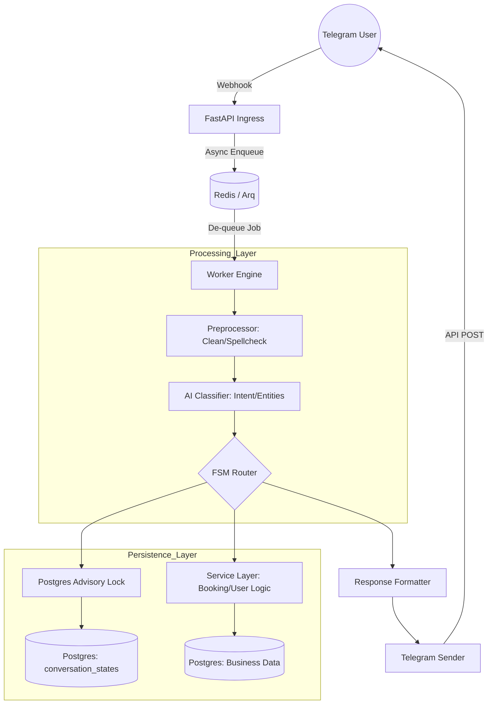

# AGENTS.md — PYTHON BOOKING OPS

## Contexto del sistema
Sistema de reservas de alta disponibilidad. 
Python 3.13, FastAPI, asyncpg, Redis, Pydantic v2.

## Principios (no leyes absolutas)
- Tipos en todas las firmas públicas. mypy strict en CI.
- Errores deben ser explícitos: loguear y propagar, nunca silenciar.
- Validación Pydantic estricta en entrada/salida del sistema.
- Tests con pytest, cobertura mínima 80% en lógica de negocio.

## Convenciones de error
- Dentro de la lógica de negocio: excepciones específicas del dominio.
- En los handlers de FastAPI: dejar que el middleware las capture.
- No devolver dicts de error desde funciones internas.

## Stack preferido
[stack real sin abreviaciones]

## Vocabulario del dominio
Usar "reserva" o "hora", no "cita".
NOTA: Los archivos en el directorio @f/ son obsoletos, pertenecen al viejo proyecto y únicamente sirven como referencia histórica para la construcción del nuevo sistema. Estos archivos NO deben ser utilizados directamente en el desarrollo actual del proyecto Titanium Booking. Toda la implementación debe basarse exclusivamente en las guías y estructuras definidas en este documento y en los directorios fuera de @f/.

# PROJECT SYNTHESIS: TITANIUM BOOKING ENGINE

## PURPOSE & SCOPE
**Titanium Booking** is a high-reliability medical appointment orchestration engine designed for Telegram. Its mission is to transform unstructured natural language and structured menu interactions into deterministic database transactions, ensuring zero-loss scheduling and high user retention.

## ARCHITECTURAL STRATEGIES
1.  **FSM-Safe Determinism:** All multi-step flows (funnels) are governed by a Finite State Machine (Python-based). AI is used only for intent classification and entity extraction, never for state transition logic.
2.  **Postgres-First State (SSOT):** The `conversation_states` table is the Single Source of Truth. Redis is used strictly for TTL caching and task queuing.
3.  **Advisory Lock Serialization:** Use of `pg_advisory_xact_lock` on `chat_id` ensures that concurrent messages from the same user are processed sequentially, preventing race conditions in the FSM.
4.  **Hybrid Extraction:** Data is extracted using Python regex/logic first; LLMs act as a fallback for high-entropy inputs.
5.  **Strict Go-Style Typing:** Zero `Any` policy, strict Pydantic boundaries, and mandatory static analysis (`mypy`/`pyright`) to eliminate runtime errors.

## FILE COHESION RULE 

Un archivo agrupa código que **cambia junto por la misma razón**.

CRITERIO PRIMARIO — "razón de cambio":
- Si dos funciones siempre se modifican juntas → mismo archivo
- Si una función puede cambiar sin afectar la otra → candidatas a separar

LÍMITES PRÁCTICOS:
- < 150 líneas  → no fragmentar, no justifica archivo propio
- 150–400 líneas → evaluar si hay dos razones de cambio claras
- > 400 líneas   → separar, casi siempre hay más de una responsabilidad

PERMITIDO en el mismo archivo:
- Helpers privados (_) que solo usa ese módulo
- Tipos locales que no cruzan el módulo
- Constantes del dominio del módulo

PROHIBIDO en el mismo archivo:
- Lógica de negocio + lógica de persistencia
- Validación de entrada + transformación interna
- Dos flows FSM distintos

## RUNTIME TYPE ENFORCEMENT

PREFERENCIA: mypy + pyright resuelven el 95% de los casos en desarrollo.
No agregar overhead de runtime donde el tipado estático es suficiente.

EXCEPCIÓN PERMITIDA — usar beartype o isinstance guards cuando:
- El dato viene de una fuente externa no tipada (webhook payload, respuesta LLM)
- El dato cruza un boundary async donde mypy pierde el hilo
- Es un punto de entrada público documentado como "acepta datos externos"

PROHIBIDO:
- Guards internos entre funciones ya tipadas estáticamente
- Usar beartype como sustituto de escribir tipos correctos

## DATA & ASYNC MODEL

LAYER SEPARATION:
- *_service.py  → lógica de negocio, sin SQL directo
- *_repo.py     → SQL puro, sin reglas de negocio

INTERNAL TYPES:
- Entre módulos internos → @dataclass(slots=True, frozen=True)
- En boundaries I/O      → Pydantic v2 strict mode
- dict entre funciones   → PROHIBIDO

ASYNC DISCIPLINE:
- async def  → solo si contiene al menos un await de I/O real
- def        → toda lógica pura, sin excepciones
- await      → asyncpg / Redis / HTTP externo / ARQ únicamente

## MENU & NAVIGATION STRUCTURE
The system operates on an 8-option Main Menu (Idle State):
1.  **Agendar hora:** Recursive flow [Select Specialty -> Select Doctor -> Select Date -> Select Time -> Confirm].
2.  **Mis horas:** List active bookings with management sub-actions (View, Prep).
3.  **Cancelar hora:** Direct access to the cancellation state machine.
4.  **Reagendar hora:** Transition from an existing booking back to the selection funnel.
5.  **Reporte:** Paginated history of user activity and medical attendance.
6.  **Recordatorios:** Submenu for enabling/disabling and configuring push notifications (Cron-based).
7.  **Información:** RAG-powered FAQ system for clinic-specific or general medical queries.
8.  **Mis datos:** Profile management (Name, Phone, Email) with FSM validation.

## INFORMATION FLOW (MERMAID)

## RECONSTRUCTION GUIDE (FOR LLMS)
To rebuild this project, focus on the following directory responsibilities:
- `f/telegram_gateway/`: Ingress and worker orchestration.
- `f/message_preprocessor/`: Normalization and security scanning.
- `f/internal/fsm_router/`: The heart of the decision engine.
- `f/internal/booking_fsm/`: State definitions and valid transitions.
- `f/internal/_db_client.py`: Optimized connection pooling and execution.
- `f/internal/_conversation_tx.py`: Transactional state management with versioning.

## CALLBACK INTEGRITY (MANDATORY)

All inline keyboard buttons MUST use versioned callback_data:
  encode(state.version, action, value) → from app.telegram.callback

FSM Router MUST reject callbacks where payload.version != state.version.

version field increments ONLY inside transition_to() — never manually.

message_id is retained for cosmetic UX edits only.
Plain callback_data strings in handlers are FORBIDDEN after this refactor.

## TODOs & REVIEWS
- **TODO:** Revisar y refinar la regla de negocio "El Profesional Cancela su Tarde" (Cancelación masiva por proveedor, regeneración de slots y notificación con rescheduler VIP para pacientes afectados).
- **TODO:** Desarrollar un frontend administrativo que permita a los auxiliares médicos buscar pacientes mediante RUT, teléfono o nombre completo. (El RUT es opcional en el registro).
