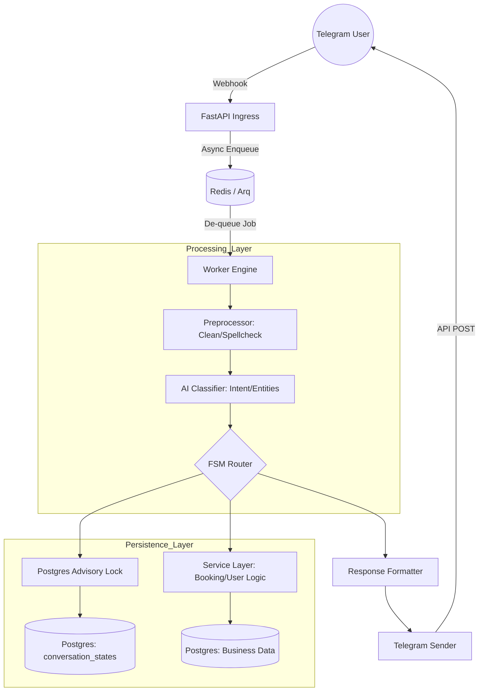

# PROJECT SYNTHESIS: TITANIUM BOOKING ENGINE

## PURPOSE & SCOPE
**Titanium Booking** is a high-reliability medical appointment orchestration engine designed for Telegram. Its mission is to transform unstructured natural language and structured menu interactions into deterministic database transactions, ensuring zero-loss scheduling and high user retention.

## ARCHITECTURAL STRATEGIES
1.  **FSM-Safe Determinism:** All multi-step flows (funnels) are governed by a Finite State Machine (Python-based). AI is used only for intent classification and entity extraction, never for state transition logic.
2.  **Postgres-First State (SSOT):** The `conversation_states` table is the Single Source of Truth. Redis is used strictly for TTL caching and task queuing.
3.  **Advisory Lock Serialization:** Use of `pg_advisory_xact_lock` on `chat_id` ensures that concurrent messages from the same user are processed sequentially, preventing race conditions in the FSM.
4.  **Hybrid Extraction:** Data is extracted using Python regex/logic first; LLMs act as a fallback for high-entropy inputs.
5.  **Strict Go-Style Typing:** Zero `Any` policy, strict Pydantic boundaries, and mandatory static analysis (`mypy`/`pyright`) to eliminate runtime errors.

## MENU & NAVIGATION STRUCTURE
The system operates on an 8-option Main Menu (Idle State):
1.  **Agendar hora:** Recursive flow [Select Specialty -> Select Doctor -> Select Date -> Select Time -> Confirm].
2.  **Mis horas:** List active bookings with management sub-actions (View, Prep).
3.  **Cancelar hora:** Direct access to the cancellation state machine.
4.  **Reagendar hora:** Transition from an existing booking back to the selection funnel.
5.  **Reporte:** Paginated history of user activity and medical attendance.
6.  **Recordatorios:** Submenu for enabling/disabling and configuring push notifications (Cron-based).
7.  **Información:** RAG-powered FAQ system for clinic-specific or general medical queries.
8.  **Mis datos:** Profile management (Name, Phone, Email) with FSM validation.

## INFORMATION FLOW (MERMAID)

## RECONSTRUCTION GUIDE (FOR LLMS)
To rebuild this project, focus on the following directory responsibilities:
- `f/telegram_gateway/`: Ingress and worker orchestration.
- `f/message_preprocessor/`: Normalization and security scanning.
- `f/internal/fsm_router/`: The heart of the decision engine.
- `f/internal/booking_fsm/`: State definitions and valid transitions.
- `f/internal/_db_client.py`: Optimized connection pooling and execution.
- `f/internal/_conversation_tx.py`: Transactional state management with versioning.

booking-titanium/
│
├── app/
│   ├── main.py                          # FastAPI app factory + lifespan
│   ├── core/
│   │   ├── config.py                    # Settings via pydantic-settings
│   │   ├── logging.py                   # Structlog setup
│   │   └── lifespan.py                  # DB pool + Redis init/teardown
│   │
│   ├── api/
│   │   └── v1/
│   │       ├── webhook.py               # POST /webhook (Telegram ingress)
│   │       └── health.py                # GET /health
│   │
│   ├── telegram/
│   │   ├── gateway.py                   # Parseo del Update de Telegram
│   │   ├── sender.py                    # Envío de mensajes / teclados
│   │   └── formatter.py                 # Construcción de respuestas UI
│   │
│   ├── worker/
│   │   ├── settings.py                  # ARQ WorkerSettings
│   │   └── tasks.py                     # process_message() — punto de entrada ARQ
│   │
│   ├── pipeline/
│   │   ├── preprocessor.py              # Limpieza, spellcheck, normalización
│   │   ├── classifier.py                # Intent + entity extraction (AI/regex)
│   │   └── extractor.py                 # Hybrid: regex first, LLM fallback
│   │
│   ├── fsm/
│   │   ├── states.py                    # Enum de estados del sistema
│   │   ├── transitions.py               # Tabla de transiciones válidas
│   │   ├── router.py                    # FSM Router: estado actual → handler
│   │   └── handlers/
│   │       ├── idle.py                  # Menú principal (8 opciones)
│   │       ├── booking.py               # Flujo: especialidad→doctor→fecha→hora→confirm
│   │       ├── cancellation.py          # FSM de cancelación
│   │       ├── reschedule.py            # Reagendar
│   │       ├── my_bookings.py           # Mis horas
│   │       ├── report.py                # Historial paginado
│   │       ├── reminders.py             # Configuración notificaciones
│   │       ├── information.py           # RAG FAQ
│   │       └── my_data.py               # Perfil usuario
│   │
│   ├── services/
│   │   ├── booking_service.py           # Lógica de negocio: crear/cancelar/reagendar
│   │   ├── user_service.py              # Perfil y datos del paciente
│   │   ├── notification_service.py      # Push / recordatorios (cron)
│   │   └── rag_service.py               # Consultas FAQ con RAG
│   │
│   ├── db/
│   │   ├── connection.py                # asyncpg pool + pg_advisory_xact_lock
│   │   ├── conversation_tx.py           # Lectura/escritura conversation_states (SSOT)
│   │   └── repositories/
│   │       ├── booking_repo.py
│   │       ├── user_repo.py
│   │       └── slot_repo.py
│   │
│   └── domain/
│       ├── models.py                    # Pydantic v2: BookingIn, UserProfile, etc.
│       ├── enums.py                     # BookingStatus, FSMState, Intent, etc.
│       └── exceptions.py               # BookingConflictError, FSMInvalidTransition, etc.
│
├── tests/
│   ├── unit/
│   │   ├── test_fsm_transitions.py
│   │   ├── test_preprocessor.py
│   │   └── test_booking_service.py
│   ├── integration/
│   │   └── test_webhook_flow.py
│   └── conftest.py
│
├── docker/
│   ├── Dockerfile
│   └── docker-compose.yml
│
├── pyproject.toml
├── AGENTS.md
└── README.md

El flujo de un mensaje en esta estructura
webhook.py → [encola] → tasks.py
                            │
                    preprocessor.py
                            │
                    classifier.py
                            │
                    fsm/router.py ──→ conversation_tx.py (lee estado)
                            │               │
                    handlers/booking.py     └── pg_advisory_lock
                            │
                    services/booking_service.py
                            │
                    db/repositories/booking_repo.py
                            │
                    formatter.py → sender.py → Telegram
